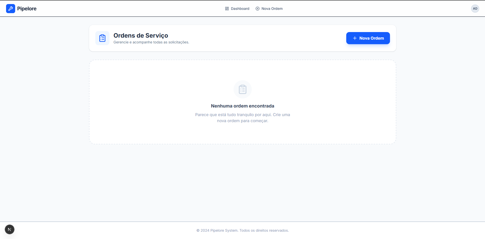

# 🔧 Pipelore - Gestão de Ordens de Serviço

Sistema **SaaS para gestão inteligente de manutenções condominiais**.

> 

------------------------------------------------------------------------

## 🚀 Sobre o Projeto

O **Pipelore** é uma aplicação **Full Stack** desenvolvida para resolver
o desafio de gerenciamento de ordens de serviço.\
Diferente de um CRUD simples, este projeto foca em **UX** e
**Arquitetura Escalável**, utilizando as tecnologias mais modernas do
ecossistema React em **2025**.

------------------------------------------------------------------------

## 🛠️ Tech Stack & Decisões

-   **Next.js 15 (App Router)** -- Renderização híbrida, rotas dinâmicas
    e arquitetura otimizada.
-   **React 19 + Server Actions** -- Criação, atualização e exclusão
    diretamente no servidor, sem necessidade de API REST interna.
-   **Drizzle ORM + SQLite** -- Persistência leve, tipada e com ótima
    DX.
-   **Tailwind CSS v4** -- Estilização moderna com variáveis CSS
    nativas.
-   **Zod** -- Schemas e validações seguras no backend e frontend.

------------------------------------------------------------------------

## ✨ Funcionalidades

### 🔹 Dashboard Interativo

Visualização intuitiva de todas as ordens com **status coloridos**.

### 🔹 Gestão Completa (CRUD)

-   Criar ordens com validação instantânea (Zod + Server Actions)\
-   Editar detalhes e mudar status\
    **Aberto → Em Andamento → Concluído**
-   Exclusão segura com modal de confirmação

### 🔹 API Pública

Endpoint REST para integrações externas:\
`GET /api/repair-orders/late` → retorna ordens atrasadas

### 🔹 Design Responsivo

Interface otimizada para **Desktop e Mobile**, com layout Clean SaaS.

------------------------------------------------------------------------

## 🚀 Como Rodar Localmente

### ✔ Pré-requisitos

-   **Node.js 18+**

------------------------------------------------------------------------

### 📥 Instalação

Clone o repositório:

``` bash
git clone https://github.com/kauannkelvinn/pipelore-challenge.git
cd pipelore-challenge
```

Instale as dependências:

``` bash
npm install
```

Configure o banco de dados (gera `local.db`):

``` bash
npx drizzle-kit push
```

Inicie o servidor de desenvolvimento:

``` bash
npm run dev
```

Acesse:\
👉 http://localhost:3000

------------------------------------------------------------------------

## 📡 Documentação da API

  -------------------------------------------------------------------------
  Método   Endpoint                    Descrição
  -------- --------------------------- ------------------------------------
  GET      `/api/repair-orders`        Lista todas as ordens

  GET      `/api/repair-orders/late`   Lista ordens atrasadas e não
                                       concluídas

  GET      `/api/repair-orders/:id`    Retorna detalhes de uma ordem
                                       específica
  -------------------------------------------------------------------------

------------------------------------------------------------------------

## 🧑‍💻 Desenvolvido com 💙 usando Next.js 15
